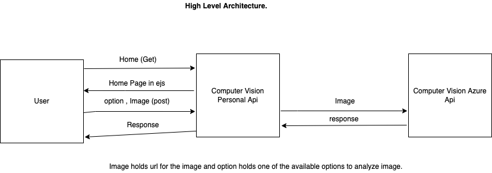
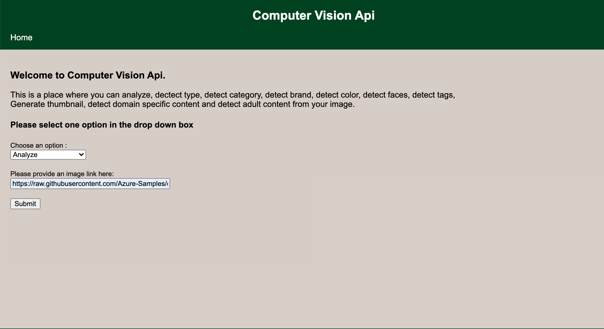
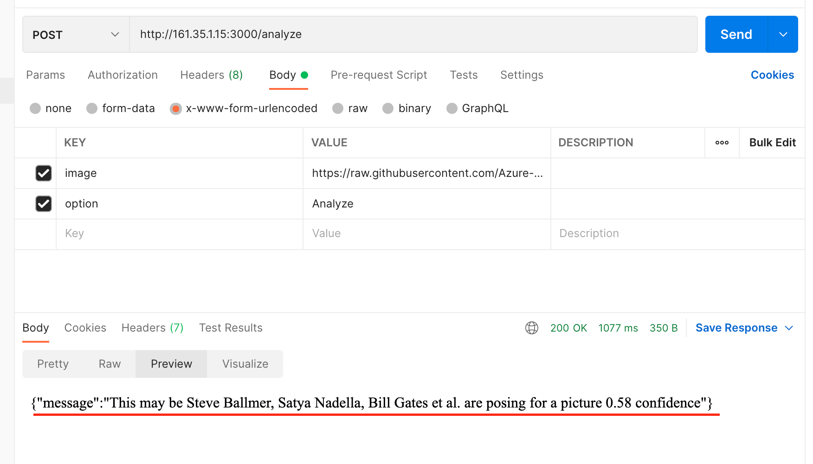
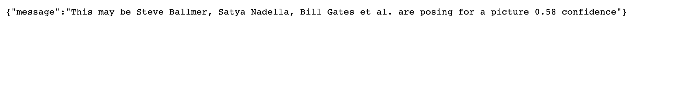

## Introduction: 
I have developed a simple web app for computer vision API which uses the Azure Computer vision Image Analysis api to analyze, detect type, detect category, detect brand, detect color, detect faces, detect objects, and detect adult content from your image. This Computer Vision API is developed using Node Js, Express, and EJs frameworks and Environment. It is developed using MVC Architecture. Please see the below other sections on how to Execute the project. 

## Execution: 
1. Download, Unzip and open in editor
2. open terminal run <b>"npm install"</b> command
3. run the server using <b>"node app.js"</b> command 

##### Download: 
Download the git repository using either by direct download as zip or by using "git clone https://github.com/dayakar16/System_Integration_Project.git" command 

##### npm Install: 
npm install is used to install all packages which are required to run the project from package.json file. 

##### node app.js 
Since starting point of my project is app.js, I started the server using "node app.js" command. 

## Testing: 
You do not require postman to test this API you can test using UI itself. if you want to use postman please use follow the instructions.

Testing Via website: 

1. Got to this website "http://161.35.1.15:3000/". 
2. Give an option and image url to find the response of option you have selected. 
3. Wait for the response to show up as json after submit. 

### Testing using postman: 

1. Give the url as this  "http://161.35.1.15:3000/analyze"
2. Give "Post"  request and select "body" and give two keys 
    key - image, value = "Give your image url you want to be tested". 
    key - option, value = "Give anyone of the options from below exactly same". 
3. The response will be back as Json. 

Options are: 
1. Analyze
2. Detect Type
3. Detect Category
4. Detect Brand
5. Detect Color
6. Detect Objects
7. Detect Faces
8. Detect Adult Content

## High level Architecture: 

## Code Flow: 
1. All router will be handled by router which are re rerouted to the controller. 
2. Controller will decide what to with the requests, it is the only one to communicate with the model to analyze the image and take back the response. This response is later showed in the ejs from the controller. 

1. Get -> router.get -> controller.index -> index Page 
2. Post -> router.post -> controller.show ->  computerVision(image,val) in model -> analyze image and returns response to controller.show -> user.

## Status Codes used in this project: 

1. 500 - Internal Server Error 
2. 401 - Bad Request ( Incorrect input)
3. 404 - Not found (url not found)
4. 200 - ok

## Error handling: 

In this project all errors are handled using middlewares and all errors are categorized into one of the errors shown in the status codes. It will be mostly wrong input unless you are trying to access the unknown url and rarely it will be internla server error. 

## Sample Input: 

Using Website: 

## Using Postman: 

 

## Sample Output: 

 

## Response for Detect Color option:

{"message":["Image is in black and white","Dominant colors: Black, Grey, White","Dominant foreground color: Grey","Dominant background color: Black","Suggested accent color: #666666"]}

## Sample Image Urls for use: 

we can use the below url for all options but for some like brands it gives response as "No brands detected".

Image Url:  https://raw.githubusercontent.com/Azure-Samples/cognitive-services-sample-data-files/master/ComputerVision/Images/celebrities.jpg

Hence use the below url for Detect Brand option: 

Image Url: https://docs.microsoft.com/en-us/azure/cognitive-services/computer-vision/images/red-shirt-logo.jpg

